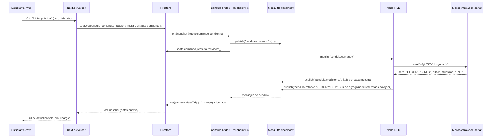

# Arquitectura general

> **Estado del sistema: bridge desplegado y probado end-to-end en la
> Raspberry Pi (2026-07-11).** Telemetría (péndulo → Firestore) y comandos
> (Firestore → péndulo, vía Node-RED) confirmados funcionando con datos
> reales, y el bridge corre como servicio `systemd` (arranca solo, se
> reinicia si falla). Ver `bridge/README.md` secciones 3-4 para la
> evidencia y `docs/despliegue-raspberry.md` para cómo se instaló en la
> práctica (incluye los problemas reales encontrados y cómo se resolvieron).

## 1. El problema

- La web (`Next.js`, desplegada en Vercel) es **serverless**: las funciones
  se despiertan por petición HTTP y no pueden mantener una conexión MQTT
  abierta 24/7. No puede ser ella la que hable directo con Mosquitto.
- El broker Mosquitto vive **solo en la red local de la Raspberry Pi**
  (`localhost:1883`, sin exponerse a internet), así que tampoco tendría
  sentido ni sería seguro intentar que la web (que corre en servidores de
  Vercel, fuera de la universidad) se conecte directo a él.
- Necesitamos algo que viva **siempre encendido, en la misma red que el
  broker**, escuchando MQTT y guardando lo que llega en un lugar que la web
  sí pueda leer en tiempo real.

## 2. La solución: un "bridge" en la Raspberry Pi

Se creó `bridge/` — un proceso Node.js **independiente de la web**, que se
instala y corre directamente en la Raspberry Pi (por ejemplo como servicio
`systemd`, ver `bridge/README.md`). Hace dos cosas, todo el tiempo:

1. **Telemetría (Péndulo → Web)**: se suscribe a `pendulo/#` en el broker
   local, limpia/normaliza cada mensaje, y lo escribe en **Firestore**
   usando el **Admin SDK** (con una cuenta de servicio, para poder escribir
   sin depender de las reglas de seguridad que sí aplican a la web).
2. **Comandos (Web → Péndulo)**: escucha en tiempo real la colección
   `pendulo_comandos` de Firestore (donde la web crea un documento cuando
   el estudiante hace clic en "Iniciar práctica"), y publica ese comando en
   el broker MQTT para que **Node-RED** lo traduzca a las instrucciones
   seriales (`cfg`, `str`) que ya sabe enviar al microcontrolador.

Firestore queda como la "memoria compartida" entre ambos mundos: el bridge
escribe/lee ahí, y la web (Next.js, con el SDK cliente de Firebase) también
lee/escribe ahí, usando `onSnapshot` para recibir cambios en tiempo real
sin tener que hacer polling.

## 3. Por qué Firestore y no WebSockets/Socket.io directo

Con Next.js en Vercel, montar un servidor de WebSockets propio (Socket.io)
requeriría un servidor Node.js persistente adicional (Vercel no sostiene
conexiones WebSocket de larga duración en sus funciones serverless
estándar). Firestore ya nos da "tiempo real" vía `onSnapshot` sin tener que
gestionar esa infraestructura, y la web ya lo usa en todas las demás
pantallas (reservas, autenticación, etc.), así que seguimos el mismo patrón
en vez de introducir una pieza nueva.

## 4. Node-RED sigue siendo el único que toca el puerto serial

El microcontrolador del péndulo se controla por **serial (UART)**, no por
red. Node-RED, ya instalado y configurado por el docente en la Raspberry
Pi, es quien tiene el puerto serial abierto y sabe traducir comandos como
`cfg\t{oscilaciones}\t{distanciaMuro}\r` y `str\r`. **No se debe abrir el
puerto serial desde dos procesos a la vez** (el bridge Node.js y Node-RED),
así que el bridge nunca toca el serial directamente: solo habla MQTT, y
deja que Node-RED siga siendo el traductor MQTT↔serial. Esto significa que
hay que agregar (una sola vez) un par de nodos a los flujos existentes de
Node-RED — ver `flujo-comandos-web-a-pendulo.md` y
`bridge/node-red-command-flow.json` / `bridge/node-red-estado-flow.json`.

## 5. Diagrama completo

## 6. Qué corre dónde (resumen)

| Componente | Dónde corre | Tecnología | Responsabilidad |
|---|---|---|---|
| Web | Vercel (nube) | Next.js (App Router) | UI, auth, reservas, mostrar datos, botón de comandos |
| Firestore | Google Cloud (nube) | Firestore | "Memoria compartida" en tiempo real entre web y bridge |
| `pendulo-bridge` | Raspberry Pi | Node.js (proceso propio, `systemd`) | Traduce MQTT ↔ Firestore en ambas direcciones |
| Node-RED | Raspberry Pi | Node-RED (ya instalado por el docente) | Traduce MQTT ↔ Serial en ambas direcciones |
| Mosquitto | Raspberry Pi | Broker MQTT local | Mensajería entre Node-RED y el bridge, solo en `localhost` |
| Microcontrolador | Físico, junto al péndulo | Firmware propio | Mide oscilaciones, ejecuta `cfg`/`str`, envía datos por serial |
