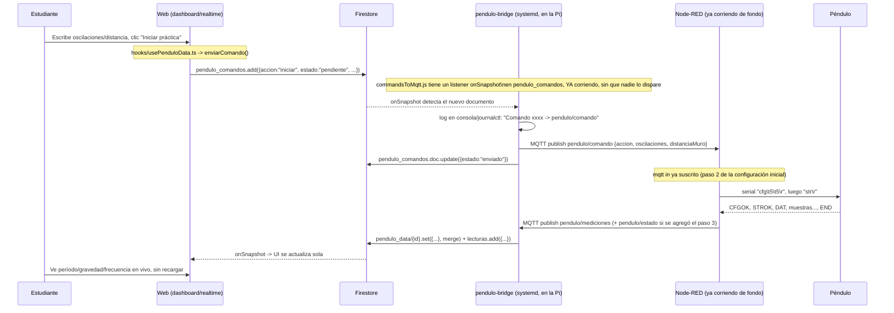

# Cómo se ejecutan los comandos desde la web (sin abrir Node-RED cada vez)

> **Estado: confirmado funcionando end-to-end (2026-07-11).** Se probó
> creando un documento manual en `pendulo_comandos` desde Firestore
> Console: el bridge lo detectó y publicó en MQTT en menos de un segundo,
> Node-RED lo recibió y lo tradujo correctamente a `cfg\t5\t5` en su nodo
> de depuración. Falta únicamente probar el disparo real desde el botón de
> la web (requiere una reserva activa en ese momento — ver
> `app/dashboard/realtime/page.tsx`), pero la cadena Firestore → bridge →
> MQTT → Node-RED ya está verificada con datos reales.

Esta es la pregunta clave: **¿cómo hago para que el botón "Iniciar
práctica" de la web dispare `cfg`/`str` en el péndulo, sin tener que entrar
manualmente al editor de Node-RED cada vez?**

Respuesta corta: **ya no tienes que entrar a Node-RED cada vez.** Solo hay
que configurar Node-RED **una vez** (agregar un nodo que escuche MQTT), y
después de eso todo el flujo ocurre automáticamente cada vez que un
estudiante usa la web. Node-RED se queda corriendo de fondo como un
servicio, escuchando, sin que nadie tenga que abrir su editor ni darle
"play" a nada manualmente.

## Configuración inicial (se hace UNA sola vez)

Esto es trabajo de instalación, no algo que se repita por cada práctica:

1. **Desplegar el bridge en la Raspberry Pi** (proceso Node.js nuevo,
   `bridge/`). Instrucciones completas en `bridge/README.md`. Al final
   queda corriendo como servicio `systemd` (arranca solo, se reinicia si
   falla) — igual que Node-RED ya corre de fondo hoy.
2. **Agregar un nodo a Node-RED** que escuche el tópico MQTT
   `pendulo/comando` y traduzca eso a los comandos seriales `cfg`/`str`
   que el docente ya tenía funcionando manualmente. Se importa el archivo
   `bridge/node-red-command-flow.json` (trae los nodos ya armados, solo
   hay que conectarlos al `serial out` que ya existe). Instrucciones en la
   sección 6 de `bridge/README.md`.
3. *(Opcional, recomendado)* Agregar el bloque de
   `bridge/node-red-estado-flow.json` para que Node-RED también avise por
   MQTT cuando el péndulo confirma el inicio (`STROK`) y el fin (`END`) de
   la práctica, en vez de que la web solo lo infiera por un timeout de
   "sin señal". Ver sección 5 de `bridge/README.md`.

Después de estos 3 pasos, **no hace falta volver a tocar Node-RED** para
usos normales. Todo lo que sigue pasa solo.

## Uso normal (automático, 100% desde la web)



**Nadie tiene que abrir el editor de Node-RED en este flujo.** El
estudiante solo interactúa con la web; todo lo demás (Firestore, el
bridge, MQTT, Node-RED, el serial) ya está corriendo de fondo, 24/7, en la
Raspberry Pi.

## Cómo ver que está funcionando ("que corran por debajo y se vea en consola")

Tienes 4 ventanas distintas donde puedes observar cada salto de la cadena,
útil sobre todo mientras pruebas por primera vez:

1. **Consola del bridge** (en la Raspberry Pi, por SSH):
   ```bash
   journalctl -u pendulo-bridge -f
   ```
   Verás líneas como `Comando abc123 -> pendulo/comando: {...}` cuando el
   estudiante hace clic en "Iniciar práctica", y `MQTT <- pendulo/mediciones:
   {...}` por cada muestra que llega del péndulo. Si corres el bridge
   manualmente (`npm start`, sin systemd) en vez de como servicio, ves lo
   mismo directo en esa terminal.

2. **Panel "Mensajes de depuración" de Node-RED** (`http://<IP_PI>:1880`):
   sigue mostrando lo mismo que ya te mostraba antes (los nodos `debug`
   existentes), pero ahora también deberías ver mensajes llegando al nodo
   `mqtt in` de comandos cuando la web publica uno.

3. **Consola del navegador (DevTools) / consola de Firebase → Firestore**:
   puedes ver el documento en `pendulo_comandos` pasar de
   `estado: "pendiente"` a `"enviado"` en segundos, y el documento
   `pendulo_data/UAC-01` actualizándose en vivo con cada muestra.

4. **`mosquitto_sub` en la Pi** (si quieres ver el tráfico MQTT crudo):
   ```bash
   mosquitto_sub -h localhost -p 1883 -u pendulo_u -P pendulo_u -t "pendulo/#" -v
   ```

## Código involucrado (quién hace qué)

| Paso | Archivo | Qué hace |
|---|---|---|
| Botón en la web | `app/dashboard/realtime/page.tsx` (`handleStartPractice`) | Llama a `enviarComando({accion:"iniciar", oscilaciones, distanciaMuro})` |
| Hook de React | `hooks/usePenduloData.ts` (`enviarComando`) | Envuelve el servicio, maneja loading/error en la UI |
| Servicio web → Firestore | `app/services/penduloDataService.js` (`enviarComandoPendulo`) | Crea el documento en `pendulo_comandos` con `estado: "pendiente"` |
| Listener en el bridge | `bridge/src/commandsToMqtt.js` (`startCommandsListener`) | `onSnapshot` sobre `pendulo_comandos where estado == "pendiente"`, corre 24/7 |
| Publicación MQTT | `bridge/src/commandsToMqtt.js` (`processComando`) | Publica en `pendulo/comando` y marca el comando como `"enviado"` |
| Traducción a serial | Node-RED (`bridge/node-red-command-flow.json`) | `mqtt in` en `pendulo/comando` → `function` que arma `cfg\t..\t..\r` + `str\r` → `serial out` existente |
| Vuelta de datos | Node-RED (flujo existente del docente + opcional `bridge/node-red-estado-flow.json`) | Lee el serial, publica `pendulo/mediciones` (y opcionalmente `pendulo/estado`) |
| Consumo en el bridge | `bridge/src/mqttToFirestore.js` (`handleMessage`) | Escribe `pendulo_data/{id}` (en vivo) y `pendulo_data/{id}/lecturas` (histórico) |
| Lectura en la web | `app/services/penduloDataService.js` (`escucharPenduloEnVivo`, `escucharLecturasRecientes`) + `hooks/usePenduloData.ts` | `onSnapshot` en tiempo real, sin polling |

Ver `docs/codigo-explicado.md` para el detalle de la lógica dentro de cada
uno de estos archivos.

## Requisito para probar el botón real en la web

El botón "Iniciar práctica" de `app/dashboard/realtime/page.tsx` solo se
habilita (`puedeIniciar`) si el usuario logueado tiene una reserva
(`reservaciones`, `estado: "pending"` o `"active"`) cuyo rango
`inicio_sesion_reserva`/`final_sesion_reserva` incluya el momento actual.
Si vas a probar el flujo completo desde la interfaz web (no desde Firestore
Console a mano), crea antes una reserva de prueba que cubra la ventana de
tiempo en la que vas a hacer la prueba — si no, el botón aparece
deshabilitado con el texto "Fuera de turno", aunque el resto del sistema
(bridge, MQTT, Node-RED) esté funcionando perfecto.
