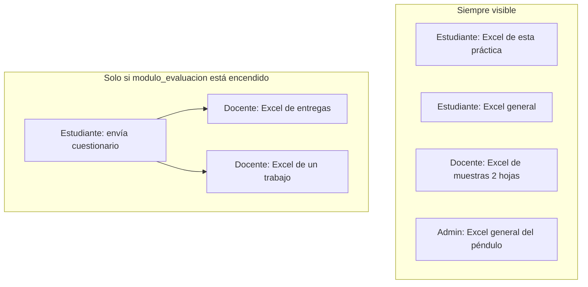
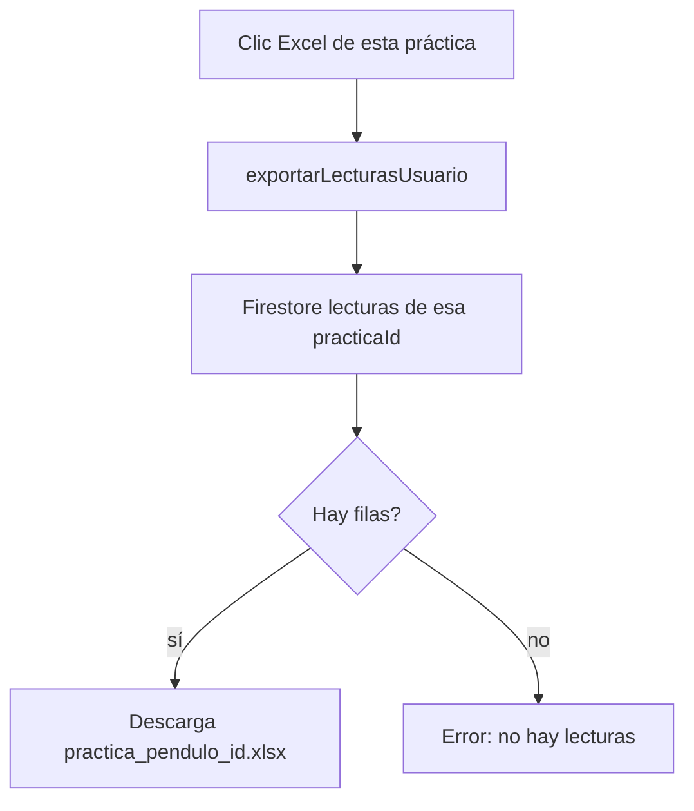
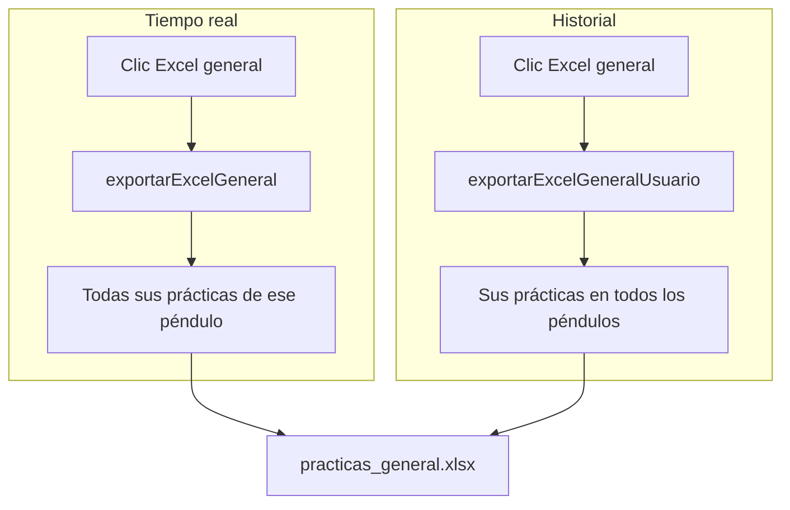
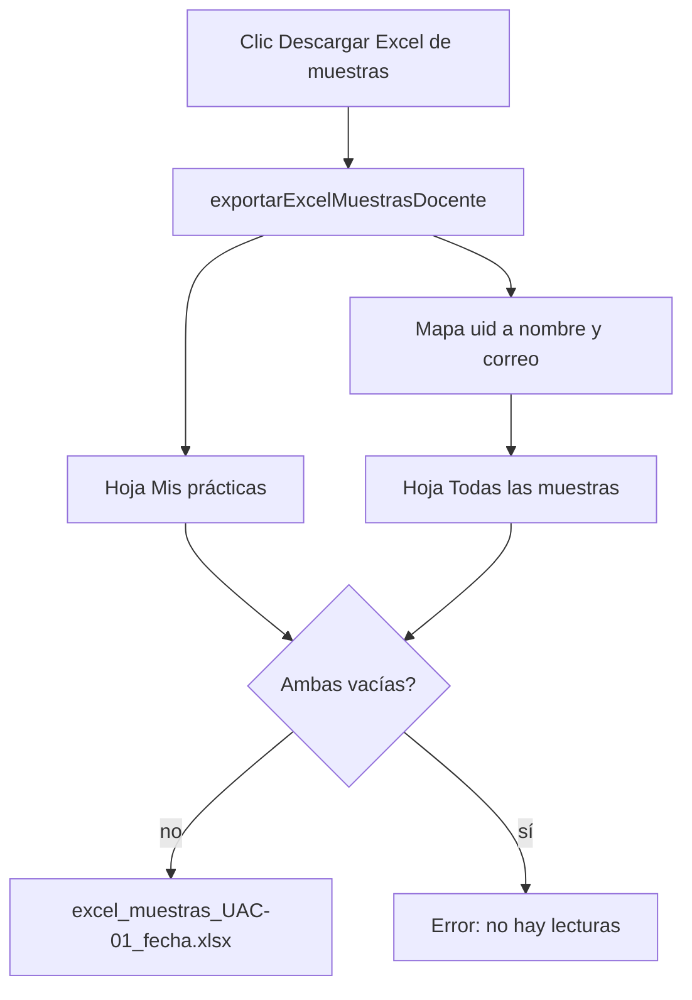
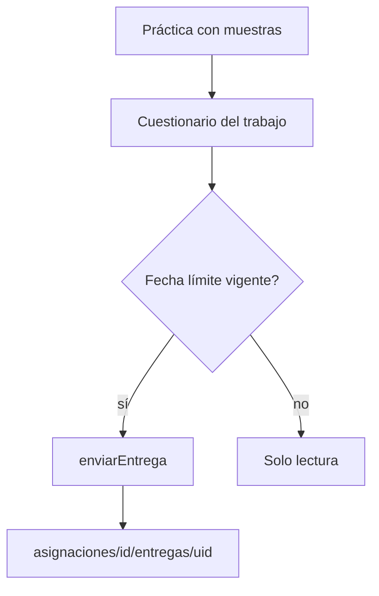
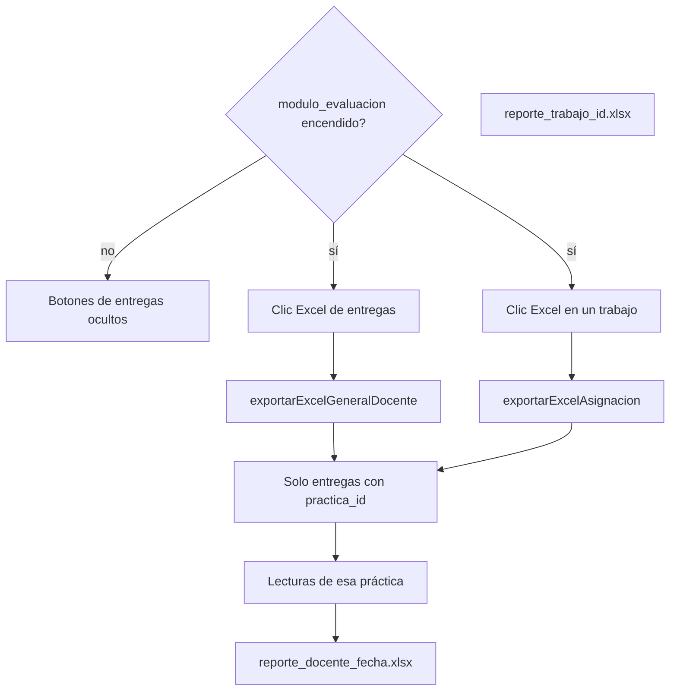
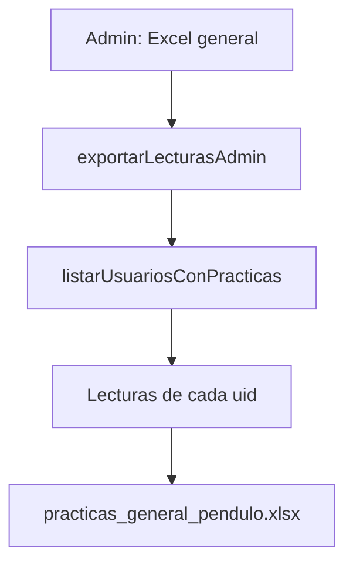

# Flujos de descarga de Excel

Cómo se genera cada `.xlsx` en la web. La fuente de verdad es
[`app/services/lecturasExportService.js`](../app/services/lecturasExportService.js).
Cada clic **regenera** el archivo desde Firestore; no hay un Excel guardado
en el servidor.

## Vista general

| Quién | Dónde se pulsa | Función | Archivo | Qué incluye |
|---|---|---|---|---|
| Estudiante | Tiempo real / Historial | `exportarLecturasUsuario` | `practica_{pendulo}_{id}.xlsx` | Muestras de **una** práctica |
| Estudiante | Tiempo real | `exportarExcelGeneral` | `practicas_general_{pendulo}.xlsx` | Todas **sus** prácticas de **ese** péndulo |
| Estudiante | Historial | `exportarExcelGeneralUsuario` | `practicas_general.xlsx` | Todas **sus** prácticas en los péndulos usados |
| Docente | `/docente` — Excel de muestras | `exportarExcelMuestrasDocente` | `excel_muestras_UAC-01_{fecha}.xlsx` | 2 hojas: propias + todas con nombre |
| Docente | `/docente` — solo plus | `exportarExcelGeneralDocente` | `reporte_docente_{fecha}.xlsx` | Entregas de sus grupos + cuestionario |
| Docente | Un trabajo — solo plus | `exportarExcelAsignacion` | `reporte_trabajo_{id}.xlsx` | Entregas de **ese** trabajo + cuestionario |
| Admin | Tiempo real | `exportarLecturasAdmin` | `practicas_general_{pendulo}.xlsx` | Todas las prácticas del péndulo + `usuario_uid` |

El plus de evaluación es el flag Firestore `configuracion/app.modulo_evaluacion`.
Apagado: se ocultan grupos, trabajos y Excel de entregas. El Excel de muestras
sigue visible.

---

## 1. Estudiante — Excel de esta práctica

Tiempo real e Historial llaman la misma función.

- **Dónde:** Tiempo real (`Excel de esta práctica`) o Historial (icono de
  descarga en una fila).
- **Lee:** `pendulo_data/{penduloId}/practicas/{uid}/lecturas` filtrado por
  `practicaId`.
- **Columnas:** muestra, fecha, periodo, gravedad, frecuencia, temperatura.
- **Archivo:** `practica_{penduloId}_{idCorto}.xlsx`.
- Si no hay lecturas, no descarga y muestra error.

---

## 2. Estudiante — Excel general

Junta **solo las prácticas del usuario que descarga**, no las de otros.

- **Tiempo real:** `exportarExcelGeneral` — un péndulo (`UAC-01` en turno).
- **Historial:** `exportarExcelGeneralUsuario` — todos los `penduloId` de sus
  reservas/prácticas.
- **Columnas:** las de una práctica más `practica_id` y `pendulo_id`.
- Cada fila es una muestra. Se regenera entero en cada clic.

---

## 3. Docente — Excel de muestras (siempre visible)

Botón **Descargar Excel de muestras** en [`app/docente/page.tsx`](../app/docente/page.tsx).
No usa grupos ni entregas. No depende del plus.

- **Hoja Mis prácticas:** lecturas del docente (mismas columnas que el Excel
  general del estudiante).
- **Hoja Todas las muestras:** todos los usuarios de `UAC-01`, sin filtro,
  con `nombre_estudiante` y `correo` (el nombre sale de `usuarios/{uid}`).
- Si una hoja no tiene filas, se exporta solo con encabezados.
- Si **ambas** están vacías, error y no hay archivo.

---

## 4. Cuestionario y plus de evaluación

Solo si el admin enciende `modulo_evaluacion`.

### Estudiante: enviar cuestionario

1. Completa una práctica **con muestras**.
2. Abre `/dashboard/trabajos/{asignacionId}`.
3. `enviarEntrega` guarda respuestas ligadas a su `practica_id`.
4. Pasada la **fecha límite** no puede enviar ni editar (solo leer).
5. Si el docente ya calificó, tampoco edita.

### Docente: Excel de entregas

- **Home `/docente`:** `exportarExcelGeneralDocente` — todas las entregas de
  sus grupos.
- **Un trabajo** `/docente/asignaciones/{id}`:** `exportarExcelAsignacion` —
  solo ese trabajo.
- **Solo** alumnos que **entregaron** (tienen `practica_id`). No es el Excel
  de todas las muestras.
- **Columnas:** Fecha, Grupo, Estudiante (correo), Muestras, Gravedad,
  Frecuencia, Periodo, Temperatura, Respuestas Cuestionario.

---

## 5. Admin — Excel general del péndulo

En Tiempo real, si el rol es Admin, el botón **Excel general** llama
`exportarLecturasAdmin` en lugar del general del estudiante.

- Recorre todos los `uid` en `pendulo_data/{penduloId}/practicas`.
- Columnas del general más `usuario_uid`.
- Archivo: `practicas_general_{penduloId}.xlsx`.

---

## Dónde está el código

| Función | Archivo |
|---|---|
| Exportes | [`app/services/lecturasExportService.js`](../app/services/lecturasExportService.js) |
| Lecturas Firestore | [`app/services/penduloDataService.js`](../app/services/penduloDataService.js) |
| Nombres de usuario | [`app/services/usuarioService.js`](../app/services/usuarioService.js) `obtenerMapaNombresUsuarios` |
| Entregas / grupos | [`app/services/grupoService.js`](../app/services/grupoService.js) |
| Flag plus | [`lib/moduloEvaluacion.ts`](../lib/moduloEvaluacion.ts) |
